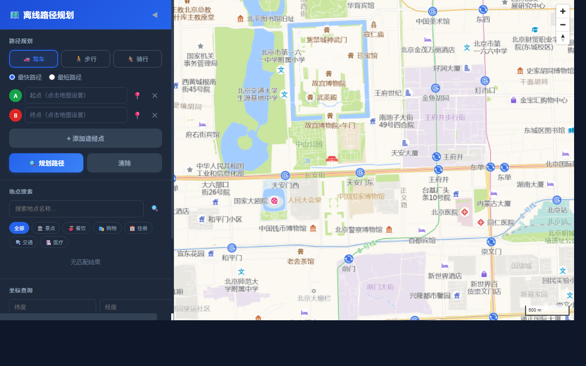
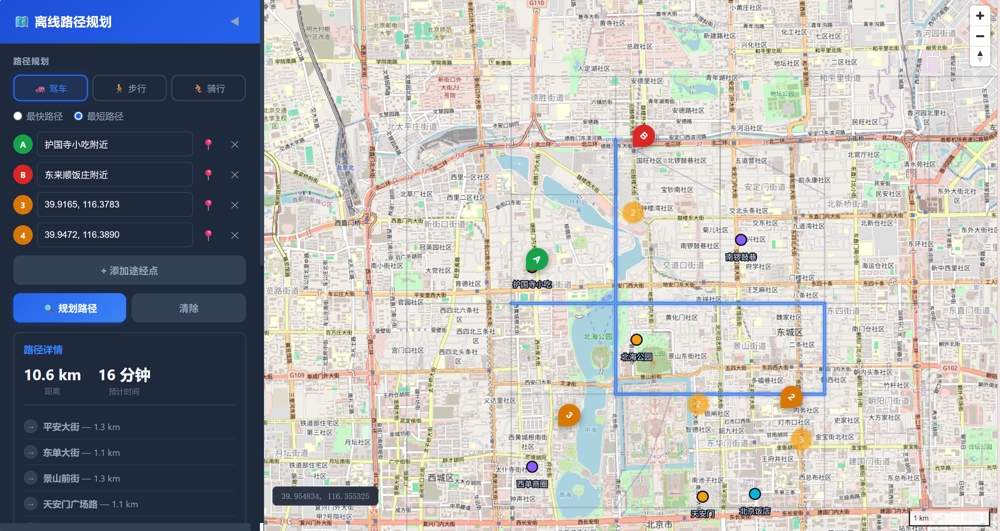
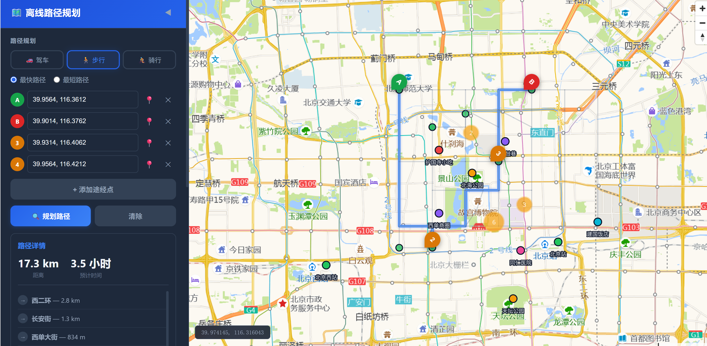
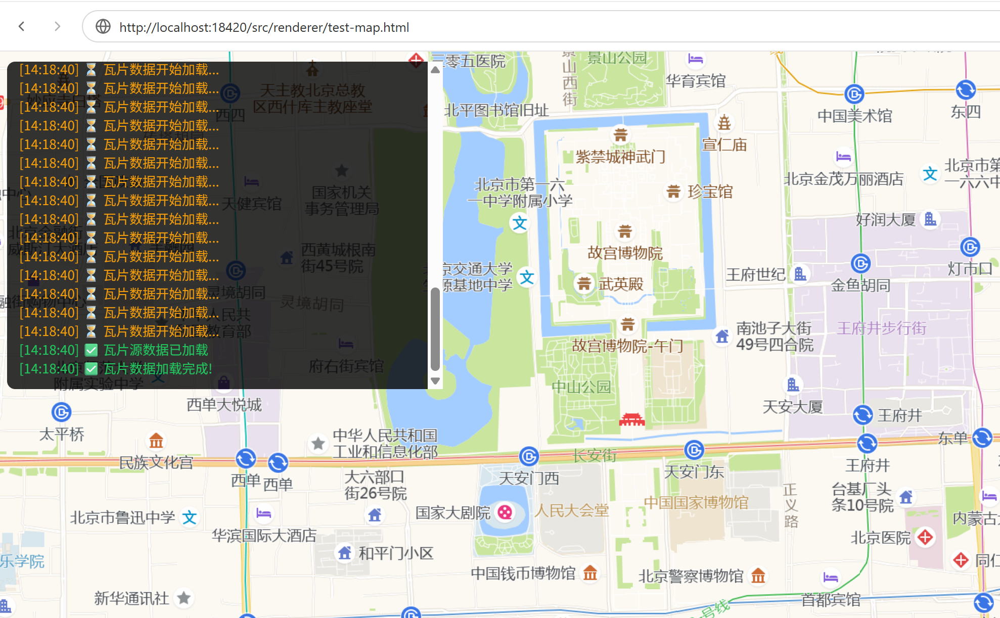

# 离线地图路径规划工具 (Offline Map Path Planning Tool)

基于 MapLibre GL JS 与 A\* 算法的离线地图路径规划桌面应用。支持驾车、步行、骑行三种模式，内置多途经点自动优化，适配中国网络环境。

## 功能特性

- **地图渲染**: 使用 MapLibre GL JS 4.7.1 渲染高德卫星瓦片地图（适配中国网络）
- **路径规划**: 内置 A\* 寻路引擎，支持驾驶、步行、骑行三种模式
- **多途经点优化**: 贪心最近邻 + 2-opt 算法，自动优化途经点顺序
- **POI 搜索**: 支持按类别搜索兴趣点，并提供逆向地理编码
- **暗色主题 UI**: 精致的深色界面，地图自定义样式
- **中国网络适配**: 使用高德瓦片、本地字体渲染，无需翻墙
- **一键启动**: `npm start` 自动启动本地服务器并打开浏览器

## 技术栈

| 层级 | 技术 |
|------|------|
| 编程语言 | JavaScript (ES6+) |
| 前端引擎 | MapLibre GL JS 4.7.1 |
| 后端 | Node.js + Express |
| 数据存储 | JSON 文件（离线数据，运行时加载到内存） |
| 路径算法 | A\* 寻路 + 贪心最近邻 + 2-opt 优化 |
| 空间索引 | 二分查找（按纬度排序） |
| 坐标系 | GCJ-02（火星坐标系，适配高德瓦片） |

## 运行效果

### 主界面 — 地图正常加载，北京核心区

左侧为暗色主题控制面板，右侧为 MapLibre GL JS 渲染的高德卫星地图，覆盖天安门、故宫、王府井等区域。



### 路径规划 — 多途经点驾驶模式

以北京核心区为样本数据，规划从护国寺小吃到东来顺饭庄，途经景山公园和天安门广场的多途经点驾驶路径，总里程 10.6 公里，预计用时 16 分钟。



### 路径规划 — 步行模式（更长距离）

步行模式覆盖更大范围，途经多个地标，总里程 17.3 公里，预计用时 3.5 小时。



### 瓦片加载诊断

调试模式下可查看瓦片加载日志，确认高德瓦片（wprd01~wprd04）正常加载。



## 快速开始

### 环境要求
- Node.js >= 16.0

### 安装与运行

```bash
# 安装依赖
npm install

# 启动服务（自动打开浏览器）
npm start
```

服务默认运行在 `http://localhost:18420`。

### 运行测试

```bash
npm test
```

端到端测试覆盖：图构建、空间索引、A\* 寻路（三种模式）、多途经点优化、POI 数据、逆向地理编码。

## 项目结构

```
.
├── assets/
│   ├── data/sample-data.json       # 样本路网数据（北京核心区，GCJ-02 坐标）
│   └── styles/dark-style.json      # 地图暗色主题样式
├── demo/
│   ├── map-main2.png               # 主界面截图
│   ├── path-planning-ui.png        # 驾驶路径规划截图
│   ├── path-planning-ui-2.png      # 步行路径规划截图
│   └── path-planning-ui-3.png      # 瓦片加载诊断截图
├── src/
│   ├── data/sample-data.js         # 样本数据生成脚本
│   ├── engine/graph.js             # 图数据结构 + 空间索引
│   ├── engine/pathfinder.js        # A\* 寻路 + 多途经点优化
│   ├── main/                       # Electron 主进程（预留）
│   └── renderer/                   # 前端页面
│       ├── index.html              # 主页面
│       ├── styles.css              # 暗色主题样式
│       └── app.js                  # 前端逻辑（含中国网络适配）
├── start.js                        # 一键启动脚本
├── test.js                         # 端到端测试（26 项）
├── test-browser-vm.js              # 浏览器环境模拟测试（16 项）
├── test-frontend.js                # 前端资源/结构/兼容性诊断（49 项）
├── package.json
└── README.md
```

## 核心架构

### 图数据模型
- **节点 (Node)**: 道路交叉口，含 GCJ-02 经纬度坐标
- **边 (Edge)**: 道路段，含长度、道路类型、通行模式
- **空间索引**: 节点按纬度排序，二分查找快速定位最近节点

### A\* 寻路
- 使用独立的 `cameFrom` Map 记录路径父节点，避免 openSet 删除导致的断链
- 边兼容性过滤：不同通行模式（驾车/步行/骑行）对应不同的可通行道路类型
- 启发函数：Haversine 地理距离（GCJ-02 坐标）

### 样本数据
以北京核心区为原型，构建 36 个节点、114 条边、20 个 POI 的离线路网数据，覆盖平安大街、东单大街、景山前街等主要道路。坐标系为 GCJ-02，与高德瓦片完全对齐。

## 中国网络环境适配

本项目针对中国网络环境做了专门适配：

| 适配项 | 原始方案 | 适配后方案 |
|--------|----------|------------|
| 地图瓦片 | OSM（被墙） | 高德 AutoNavi style=7 暗色卫星图 |
| MapLibre 库 | unpkg.com CDN（被墙） | 本地 node_modules |
| 中文字体 | demotiles.maplibre.org PBF 字体（404/被墙） | `localIdeographFontFamily` 本地系统字体 |
| 坐标系 | WGS-84 | GCJ-02（与高德瓦片对齐） |

## 已知问题与踩坑记录

| # | 问题 | 根本原因 | 解决方案 |
|---|------|----------|----------|
| 1 | Electron `require('electron')` 返回路径字符串 | Electron v33.4.11 加载异常 | 改用内嵌 HTTP 服务器 + 浏览器模式 |
| 2 | A\* 路径重建断裂 | openSet 删除节点后 parent 丢失 | 独立 `cameFrom` Map 跟踪路径 |
| 3 | walking/cycling 无法通行 | edgeCompatible 限制过严 | 步行/骑行开放所有道路类型 |
| 4 | **地图瓦片空白** | MapLibre **不支持** `{1-4}` 子域名语法 | `tiles` 数组展开为 4 条独立 URL |
| 5 | **中文标签方块** | 外部 PBF 字体服务在中国不可用 | `localIdeographFontFamily` 本地字体 |
| 6 | 路网不连通 | 交叉点坐标偏差 | 重构为交叉点引用式路网 |

> **关键踩坑**: MapLibre GL JS **不支持** Leaflet 式的 `{1-4}` 或 `{s}` 子域名语法，子域名必须显式列在 `tiles` 数组中。这是导致地图空白的直接原因。

## License

MIT
